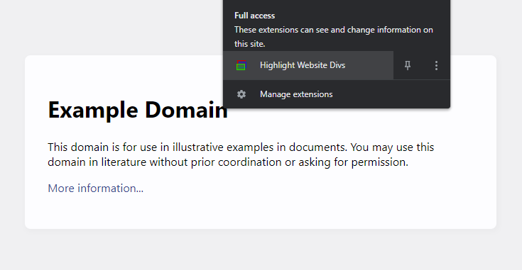
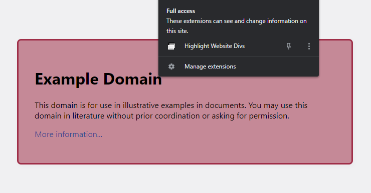

# Website div highlighter

### Highlight every div on your website in a unique color. :closed_book::orange_book::ledger::green_book::blue_book:

### This was created in an effort to simplify web development, by highlighting every div. :computer:

## ❓ How to implement it?

### For Google Chrome:

1. Download the chrome-plugin.zip
2. Open [chrome://extensions/](chrome://extensions/)
3. Enable '_Developer Mode_'.
4. Drag and drop chrome-plugin.zip to chrome://extensions/
5. Open your website.
   eg. [this example](https://example.com/)
6. Click on the extension to highlight divs!
   
7. Click on the extension again to restore div colours.
   

### For other browsers:

1. Open your website.
   eg. [this example](https://example.com/)
2. Copy, paste and run the code in your browser javascript scratchpad.

```
main(); // To run the plugin
```

or

```
main(false); // To restore elements
```

#### :arrow_up_small: Features in development.

- [x] Prototype code to add color to every div. :heavy_check_mark:
- [x] Function to revert div colors. :heavy_check_mark:
- [x] Google Chrome browser [extension as .zip](https://bashvlas.com/blog/install-chrome-extension-in-developer-mode/). :heavy_check_mark:
- [x] Add user interface indicating when extension is active or inactive. :heavy_check_mark:
- [ ] Add feature: Restore div elements to their original colours instead of clearing.
- [ ] Add feature: Keyboard shortcuts to toggle extension for Windows and MacOS.
- [ ] Public listing of Google Chrome browser extension.
- [ ] Custom features to Google Chrome browser extension.

#### ❓ What is a javascript scratchpad?

Good question,

A clearer example of how to implement this in **Google Chrome**:

1. Open your website.
   eg. [this example](https://example.com/)

2. View page source: Right click anywhere > Inspect

3. In the **Inspect** menu, go to:
   'Sources' tab \>
   'Snippets' tab \>
   \+ New snippet \>

4. Paste the .js code into the snippet.

5. Save the snippet:
   eg.
   On Windows: CTRL + S.
   On macOS: Command + S.

6. **Run the code**:
   eg.
   On Windows: Ctrl + Enter.
   On macOS: Command + Enter.

#### Every div on the website will change to a transparent color with a clear border. :rainbow:

#### In development as of 14th December, 2022.
